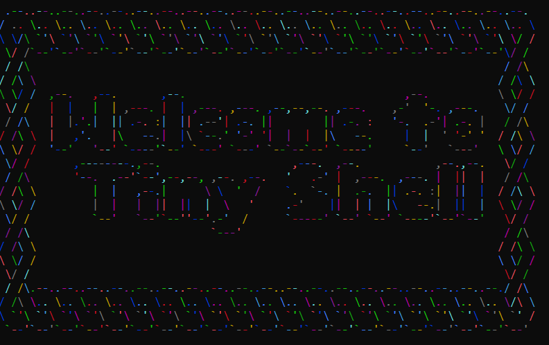

# Practice Project 1 : Tiny Shell
## 1. Description
This project includes TinyShell - practical project of Operating System class - IT3070, semester 2023.2.

## 2. Member List
- Đoàn Duy Tùng 20224906
- Văn Đức Cường 20220021
- Ngô Đức Chung 20224827
- Nguyễn Văn Đăng 20224946
## 3. Work Assignment
| Member | Task |
|--------|------|
| Tùng   | Create child processes (foreground, background mode) |
| Cường  | Manage processes (List, kill, stop, resume)          |
| Chung  | Special commands (date, time, dir, ...)              |
| Đăng   | Execute .bat files, cmd command                      |
## 4. Usage
You can use TinyShell by compiling it with the following command:
```
g++ -std=c++23 -lgdi32 main.cpp -o main
```

You might see some warnings like: `backslash and newline separated by space`, but you can ignore them. Next, run the `main.exe` file. The console will display:
```
Enter command: 
```
... and let's start your adventure in our TinyShell world ^^
## 5. License
This project is protected by the MIT License.
